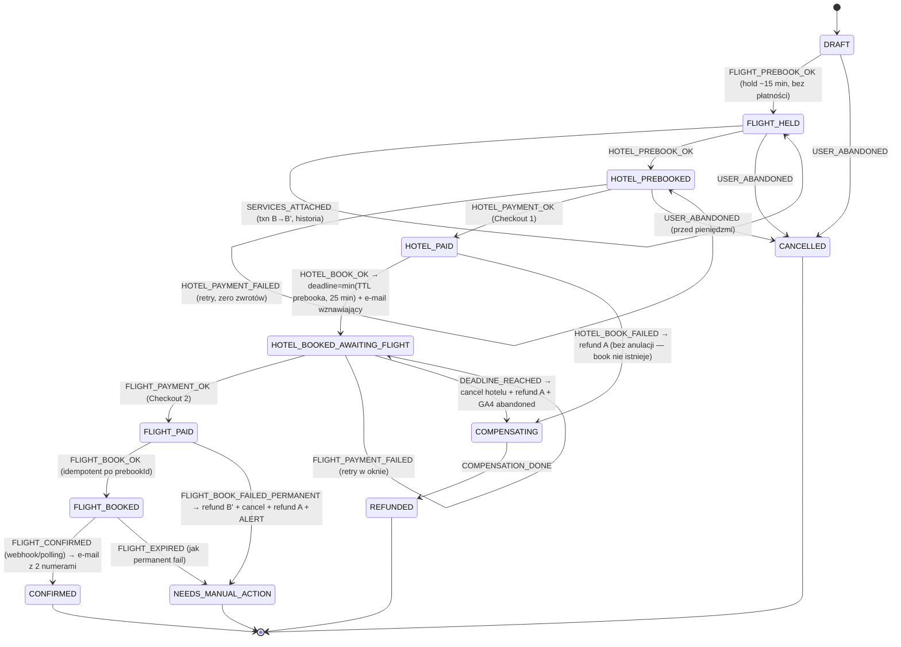

# Decyzje projektowe — Pakiety Lot + Hotel

> Źródło: `PROMPT_PAKIETY_LOT_HOTEL.md` §0 + empiryka istniejącego modułu lotów
> (`src/lib/flights/*`, kontrakt zweryfikowany 2026-06-13/14, loty LIVE na prod: PR #102).
> Kontrakt LiteAPI: patrz `docs/LITEAPI_FLIGHTS_CONTRACT.md`.
> Ostatnia aktualizacja: 2026-07-12 (Faza 0).

## Ustalenia infrastrukturalne (Checkpoint 0.1)

- **Dostawca lotów = wyłącznie LiteAPI Flights.** `DUFFEL_ACCESS_TOKEN` jest w `.env.local`, ale
  **zero użycia w `src/`** → legacy, ignorujemy. Pakiety reużywają `src/lib/flights/client.ts` 1:1.
- **Sandbox: PORZUCONY (decyzja właściciela 2026-07-12).** W `.env.local` są tylko klucze PROD
  (`LITEAPI_PROD_*`, `LITEAPI_ENV="production"`, `BOOKING_FLOW_MODE="live"`). Jedziemy na produkcji.
  - Zasady bezpieczeństwa na PROD: `rates`/`verify` = read-only, wolno bez pytania. `prebook` =
    hold bez obciążenia, wygasa sam (~15 min), tylko gdy realnie potrzebny. **`bookings` + potwierdzenie
    płatności = realne pieniądze → wyłącznie za świadomą zgodą właściciela, nigdy autonomicznie.**
- **`DATABASE_URL`**: obecny lokalnie. Postgres (saga `PackageBooking`) dotyczy dopiero **Fazy 2** —
  to bramka wejścia do Fazy 2, nie blokuje Fazy 0/1. Do potwierdzenia na Vercel przed Fazą 2.
- **Vercel CLI**: niezainstalowany. Faza 1 dev = `npm run dev` (next dev); `vercel dev`/pull env
  niepotrzebne do search+listing+landingów.
- **Baza gałęzi**: `packages/phase-0` z `feat/search-milestone` (lokalny `main` cofnięty; feat
  zawiera milestone wyszukiwarki + perf lotów — nic nie tracimy).
- **Flaga**: brak jakichkolwiek `NEXT_PUBLIC_FEATURE_*` w repo → wprowadzamy `NEXT_PUBLIC_FEATURE_PACKAGES`
  jako nową konwencję (domyślnie off).

## Bramka §0 — statusy

### 1. [PRAWNE — ROZSTRZYGNIĘTE decyzją właściciela 2026-07-12: POWIĄZANE USŁUGI TURYSTYCZNE]
LiteAPI nie rozstrzyga roli organizatora — dostarcza dwie niezależne usługi. **Właściciel wybrał model
„powiązane usługi turystyczne" (PUT).** To jest decyzja biznesowa właściciela, NIE porada prawna z mojej
strony. Konsekwencje, które pozostają w mocy mimo wyboru PUT:
- **Obowiązki nie znikają:** ułatwiający nabywanie PUT też podlega zabezpieczeniom (TFG/gwarancja),
  obowiązkom informacyjnym i odrębnym potwierdzeniom. Do domknięcia przy Fazie 2.
- Architektura już to wspiera: **dwie odrębne transakcje, dwa descriptory, dwa potwierdzenia** (§4) —
  spójne z PUT (lżejsza pozycja niż impreza turystyczna z jednym MoR).
- **Planowanie Fazy 2 ODBLOKOWANE**, ale wejście na prod nadal wymaga: potwierdzenia `DATABASE_URL` na
  Vercel, potwierdzenia kontraktowego waluty obciążenia (pkt 7) i domknięcia zabezpieczenia/TFG.

### 2. [PŁATNOŚĆ — ANSWERED]
Brak wspólnego PaymentIntent. Hotel prebook i flight prebook zwracają OSOBNE `transactionId`/`secretKey`
(dwie transakcje, dwa descriptory NUITEE na wyciągu). Brak 2-phase commit. Jedna płatność = własny MoR +
własny Stripe — **NIE w MVP** (sprzężone z pkt 1).

### 3. [TICKETING — ANSWERED]
Async możliwy zależnie od providera. Webhooki lotu: `flight.book.pending.confirmation`,
`flight.book.confirmed`, `flight.book.failed`, `flight.book.expired` + hotelowe `booking.prebook_error`,
`booking.book_error`. Fallback: polling `GET /flights/bookings/{id}` do CONFIRMED (źródło prawdy o statusie).

### 4. [ANCILLARIES — ANSWERED, empirycznie potwierdzone w repo]
`servicesAttachable` **istnieje** i jest zmapowany (`src/lib/flights/ancillaries.ts`, prebook 2026-06-14):
`groups[] = { category:"seat"|"baggage", label, services[] }`; service = `{ serviceId, name, category,
pricing.display.{amount,currency}, passengerType, segmentKey, metadata.seat? }`.
Zaobserwowano: **478 miejsc (0–188 zł) + „Extra Baggage" 10/20/40/60 kg (178–639 zł)**.
Attach services aktualizuje prebook i zwraca NOWY `transactionId`/`secretKey` (stary martwy) →
**payment element lotu montować dopiero PO finalnym wyborze bagaży**.

### 5. [BLIK — ANSWERED: NIEMOŻLIWY]
Potwierdzone (support Nuitee): BLIK niedostępny w Payment SDK (capture manual). Konsekwencje:
(a) zero logo/wzmianek BLIK w UI pakietowym, (b) na kroku płatności jawnie: karta / Apple Pay / Google Pay,
(c) event GA4 `package_payment_method_shown` + pomiar dropu.

### 6. [ANCILLARIES per LCC — ANSWERED, ale premisa spec do korekty]
**Korekta specyfikacji:** LiteAPI Flights = GDS Travelport = **BRAK Ryanair/Wizz** (potwierdzone empirycznie
2× — patrz pamięć `reference_liteapi_no_lcc`). Testy „ancillaries dla Wizzair/Ryanair" ze spec/executora są
**bezprzedmiotowe** — tych linii nie da się w ogóle wyszukać. Ancillaries **działają na przewoźnikach GDS**
(LOT, legacy carriers). Implementacja bez zmian: krok bagaży renderuje się DYNAMICZNIE z `servicesAttachable`;
gdy puste → „Dodatkowy bagaż dokupisz u przewoźnika po potwierdzeniu" (uczciwie).

### 7. [WALUTA — ANSWERED częściowo]
`POST /flights/rates` przyjmuje `currency:"PLN"` — wyświetleniowo PLN end-to-end OK (potwierdzone w kliencie).
Settlement/FX i waluta obciążenia na wyciągu NIE gwarantowane w docs → w UI **nie** obiecuj „obciążenie w PLN",
pisz „ceny w PLN". Do potwierdzenia kontraktowo przed Fazą 2.

### 8. [KALENDARZ CEN LOTÓW — ANSWERED: BRAK ENDPOINTU]
Price Index API = tylko hotele. Brak „cheapest dates" dla lotów. Ceny „od" na landingach/homepage =
**wyłącznie cache warmowany** (rozszerzenie istniejącego `api/cron/warm-flights`): top kierunki × 3 terminy
(najbliższy weekend, +2 tyg., +4 tyg.), `POST /flights/rates` z `currency:"PLN"`, odświeżanie co 6–12h,
wynik w Redis. **Zero live-batchowania przy request usera** (rate limits + koszt — już raz zeszliśmy z Hobby na Pro).

### 9. [DANE PASAŻERA — ANSWERED, empirycznie potwierdzone w repo]
Prebook wymaga: `contact` (firstName/lastName/email/phoneNumber/phoneCountryCode) + `passengers[]` z płaskimi
polami: `title, firstName, lastName, birthday, gender, nationality, type, documentType, documentNumber,
documentExpiry, documentIssueCountry` (patrz `src/lib/flights/client.ts:toLiteApiPassenger`).
Diakrytyki: API nie transliteruje — normalizacja po naszej stronie (walidacja A–Z, inline „Michał → MICHAL"
do akceptacji jednym tapnięciem). Błąd walidacyjny prebooka → czytelny komunikat przy właściwym polu.

## Potwierdzony flow Flights API
`POST /flights/rates` → `POST /flights/verify` (`priceChanged:boolean`, TTL ~5 min) →
`POST /flights/prebooks` (`usePaymentSdk:true`, hold ~15 min, zwraca `prebookId`/`transactionId`/`secretKey`/
`servicesAttachable`) → opcjonalnie `/services` (NOWY txn/secret) → `POST /flights/bookings` (idempotent po
`prebookId`) → `GET /flights/bookings/{id}`. TTL = guidance; `expiration` z response = źródło prawdy.

## Zatwierdzone do Fazy 1 (moje decyzje, do akceptacji właściciela)

- [x] Reużycie `src/lib/flights/*` jako `flightsClient` pakietów (zero duplikacji).
- [x] Dwuczęściowy checkout (Hotel → Lot) — architektura, kod w Fazie 2.
- [x] Krok bagaży renderuje się z `servicesAttachable` (mapper już istnieje).
- [x] Cache warming = rozszerzenie `api/cron/warm-flights` o pakiety (top 10 kierunków).
- [x] Formularz danych: transliteracja „Michał" → „MICHAL".
- [x] Flaga `NEXT_PUBLIC_FEATURE_PACKAGES` (off na prod, on na staging).
- [x] Warunek pakietu MVP: tylko hotelowe rate'y z **darmową anulacją** (bezpiecznik kompensacji).

## Zatwierdzone do Fazy 2 (planowanie ODBLOKOWANE — model PUT; wejście na prod: obowiązki pkt 1 + poniżej)

- [x] Saga `PackageBooking` w Postgres (stany DRAFT → CONFIRMED + kompensacje, deadline
      `HOTEL_BOOKED_AWAITING_FLIGHT` = min(TTL prebooka, 25 min)) — **KOD GOTOWY (Krok 2.0,
      2026-07-14)**: model Prisma + migracja `20260714120000_add_package_booking_saga`
      (deploy = bramka: DATABASE_URL na Vercel), maszyna stanów + orkiestrator + adapter
      w `src/modules/packages/saga/` (26 testów). Diagram niżej.
- [x] Webhooki + cron + polling — **KOD GOTOWY (Krok 2.2-backend, 2026-07-15)**:
      `/api/webhooks/liteapi/flights` (HMAC-SHA256, mapper tolerancyjny, 200 dla eventów
      spoza pakietów — wspólne konto z hotelowym flow), cron `/api/cron/package-deadlines`
      co 5 min (sweep deadline'ów + polling `GET /flights/bookings/{id}` jako źródło prawdy),
      produkcyjny EffectSink (cancel hotelu przez LiteAPI; **REFUNDY ŚWIADOMIE RĘCZNE** —
      CRITICAL alert do admina, bo mechanika refundu = TODO:VERIFY; e-maile Resend; alerty).
      Zastrzeżenie: nagłówek/format podpisu i kształt payloadu webhooka oraz enum statusów
      bookingu = TODO:VERIFY na pierwszym realnym evencie (mapper jest tolerancyjny,
      nieznany status = pending — nigdy nie kompensujemy na ślepo). Wymaga env
      `LITEAPI_WEBHOOK_SECRET` (bez niego endpoint odmawia — 503).
- [ ] `DATABASE_URL` potwierdzony na Vercel PROD (lokalnie PLACEHOLDER `REPLACE_ME_*` —
      integracyjne testy DB odłożone do provisioningu; adapter sagi celowo NIE ma
      fallbacku in-memory: brak bazy = głośny wyjątek, checkout się nie zaczyna).
- [ ] Potwierdzenie kontraktowe waluty obciążenia (pkt 7).

### Maszyna stanów sagi (Krok 2.0 — zaimplementowana, `saga/sagaMachine.ts`)

Właściwości (pokryte testami): duplikaty webhook-vs-polling = `ignored` (no-op); przejścia
spoza tabeli = `invalid` (stan nietknięty, log, nigdy wyjątek); zapis przez optimistic lock
(`stateVersion`, retry z przeładowaniem, max 3); efekty uboczne DEKLARATYWNE, wykonywane PO
zapisie stanu (at-least-once — sink musi być idempotentny), błąd efektu nie cofa przejścia —
ląduje w `compensationLogJson` + wyniku (admin widzi, klient nigdy nie dostaje 500).

## Otwarte TODO:VERIFY (nie zgadujemy — pytamy właściciela / testujemy realną rezerwacją)

- **`POST /flights/prebooks/{id}/services`**: kontrakt attach→nowy txn/secret — udokumentowany w spec i
  `ancillaries.ts`, ale **niewpięty i niepotwierdzony realną rezerwacją** (dotyka ścieżki płatności).
  Weryfikacja dopiero w Fazie 2 (test z kartą / zgoda właściciela).
- **Reuse metody płatności między dwoma PaymentIntentami** (karta wpisana raz vs dwa razy) — `TODO:VERIFY`
  na realnym checkoucie (Faza 2).
- **Schemat webhooków** (pola/podpis HMAC vs JWT) — do potwierdzenia na realnym evencie prod (Faza 2).
- **APIS / wymogi dokumentowe per trasa** — mapowanie błędu walidacyjnego prebooka na pole (Faza 2).
